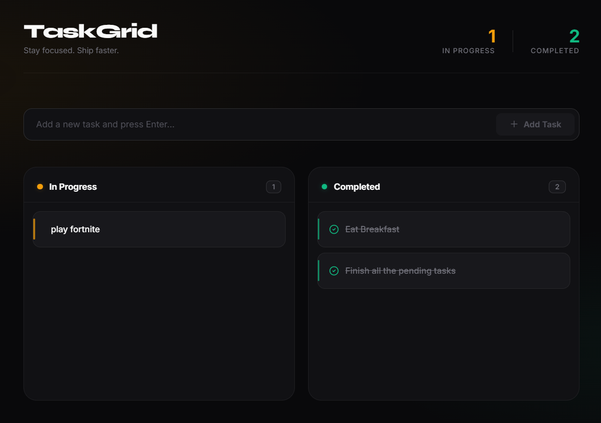

# TaskGrid

> A full-stack Mini Kanban Task Manager - clean architecture, scalable design, and a premium dark UI.



---

## Table of Contents

- [Overview](#overview)
- [Tech Stack](#tech-stack)
- [Features](#features)
- [Project Structure](#project-structure)
  - [Backend Structure](#backend-structure)
  - [Frontend Structure](#frontend-structure)
- [Getting Started](#getting-started)
  - [Prerequisites](#prerequisites)
  - [Environment Variables](#environment-variables)
  - [Backend Setup](#backend-setup)
  - [Frontend Setup](#frontend-setup)
- [API Reference](#api-reference)
- [UI Overview](#ui-overview)

---

## Overview

TaskGrid is a full-stack Kanban-style task manager built as a mini project. Tasks are organized into two columns - **In Progress** and **Completed** - and can be created, moved between columns, and deleted. All data is stored in-memory on the backend (no database required).

---

## Tech Stack

| Layer      | Technology                                  |
|------------|---------------------------------------------|
| Frontend   | React 19, TypeScript, Vite                  |
| Styling    | Vanilla CSS (dark theme, glassmorphism)     |
| Icons      | Lucide React                                |
| HTTP Client| Axios                                       |
| Backend    | Node.js, Express 5, TypeScript              |
| Dev Tools  | Nodemon, ts-node                            |

---

## Features

- ✅ Create tasks with a title
- ✅ View tasks grouped into **In Progress** and **Completed** columns
- ✅ Move tasks between columns (To Do ↔ Done)
- ✅ Delete tasks
- ✅ Live task count stats in the header
- ✅ Loading state and error handling
- ✅ CORS restricted to allowed origins
- ✅ Structured logger with color-coded log levels
- ✅ Clean architecture — interfaces, classes, constants, services, hooks, components

---

## Project Structure

```
TaskGrid/
├── backend/
│   └── src/
│       ├── index.ts                  # Entry point — starts the server
│       ├── app.ts                    # Express app config, CORS, middleware
│       ├── types/
│       │   └── task.ts               # ITask type and TaskStatus union
│       ├── interfaces/
│       │   └── task.interface.ts     # ITaskStore and ITaskController contracts
│       ├── constants/
│       │   ├── httpStatus.ts         # HTTP_STATUS constants
│       │   └── errorMessages.ts      # ERROR_MESSAGES constants
│       ├── store/
│       │   └── taskStore.ts          # TaskStore class (in-memory CRUD)
│       ├── controllers/
│       │   └── taskController.ts     # TaskController class (request handlers)
│       ├── routes/
│       │   ├── index.ts              # Aggregates all feature routers under /api
│       │   └── tasks.ts              # /api/tasks route definitions
│       └── utils/
│           └── logger.ts             # Custom Logger class (info/warn/error/debug)
│
└── frontend/
    └── src/
        ├── App.tsx                   # Root component — pure composition
        ├── App.css                   # Component styles
        ├── index.css                 # Global styles, CSS variables
        ├── types/
        │   └── task.ts               # Task, TaskStatus, API payload types
        ├── services/
        │   └── taskService.ts        # Axios-based API service layer
        ├── hooks/
        │   └── useTasks.ts           # Custom hook for task state & API calls
        └── components/
            ├── Header.tsx            # Brand + live stats bar
            ├── AddTaskForm.tsx       # Controlled input form
            ├── TaskColumn.tsx        # Reusable column wrapper
            ├── TaskCard.tsx          # Individual task card with actions
            └── ErrorBanner.tsx       # Error display component
```

---

### Backend Structure

The backend follows a layered, class-based architecture:

| Layer | Folder | Responsibility |
|---|---|---|
| Entry | `index.ts` | Starts the HTTP server |
| App Config | `app.ts` | Express setup, CORS, request logger, error handler |
| Types | `types/` | Shared data shapes (`ITask`, `TaskStatus`) |
| Interfaces | `interfaces/` | Contracts (`ITaskStore`, `ITaskController`) for dependency injection |
| Constants | `constants/` | Centralized HTTP status codes and error message strings |
| Store | `store/` | `TaskStore` class — in-memory data persistence |
| Controllers | `controllers/` | `TaskController` class — handles request/response logic |
| Routes | `routes/` | Express routers — wire controllers to HTTP endpoints |
| Utils | `utils/` | `Logger` class — structured, color-coded terminal logging |

**Data Flow:**
```
Request → routes/tasks.ts → TaskController → TaskStore → Response
```

**Logger Output Example:**
```
2026-06-15T09:16:57.123Z INFO  [Server]         TaskGrid API running at http://localhost:3000
2026-06-15T09:17:02.345Z INFO  [HTTP]           POST /api/tasks
2026-06-15T09:17:02.347Z INFO  [TaskController] create → Task #1 "Buy milk" created
2026-06-15T09:17:09.001Z WARN  [TaskController] updateStatus → rejected: invalid status "finished"
2026-06-15T09:17:11.500Z WARN  [CORS]           Blocked request from disallowed origin: http://evil.com
```

---

### Frontend Structure

The frontend is fully component-driven with a clean separation of concerns:

| Layer | Folder | Responsibility |
|---|---|---|
| Types | `types/` | `Task`, `TaskStatus`, `CreateTaskPayload`, `UpdateTaskPayload` |
| Services | `services/` | Axios instance + typed API methods (`taskService`) |
| Hooks | `hooks/` | `useTasks` — manages task state, API calls, and error handling |
| Components | `components/` | Isolated, reusable UI components |
| Root | `App.tsx` | Composes components; delegates logic to the hook |

**Component Tree:**
```
App
├── Header          (brand + live todo/done counts)
├── ErrorBanner     (conditionally shown on API errors)
├── AddTaskForm     (controlled input, calls onAdd)
└── board
    ├── TaskColumn [col-todo]
    │   └── TaskCard × N  (move → done, delete)
    └── TaskColumn [col-done]
        └── TaskCard × N  (move → todo, delete)
```

---

## Getting Started

### Prerequisites

- [Node.js](https://nodejs.org/) v18 or higher
- npm v9 or higher

---

### Environment Variables

#### Backend — `backend/.env`

```env
# Port the Express server listens on
PORT=3000
```

#### Frontend — `frontend/.env`

```env
# Base URL of the backend API (used by the axios service)
BACKEND_URL=http://localhost:3000
```

> **Note:** The frontend currently hardcodes `http://localhost:3000/api` in `taskService.ts`. Update that value when deploying to production or replace it with `import.meta.env.VITE_BACKEND_URL` for full env-variable support.

---

### Backend Setup

```bash
# 1. Navigate to the backend directory
cd backend

# 2. Install dependencies
npm install

# 3. Create environment file
cp .env.example .env
# or manually create backend/.env with the content shown above

# 4. Start the development server (with hot-reload via nodemon)
npm run dev
```

The API will be available at: **`http://localhost:3000/api/tasks`**

**Available scripts:**

| Script | Command | Description |
|---|---|---|
| `dev` | `nodemon src/index.ts` | Development server with hot-reload |
| `build` | `tsc` | Compile TypeScript to `dist/` |
| `start` | `node dist/index.js` | Run compiled production build |

---

### Frontend Setup

```bash
# 1. Navigate to the frontend directory
cd frontend

# 2. Install dependencies
npm install

# 3. Create environment file
cp .env.example .env
# or manually create frontend/.env with the content shown above

# 4. Start the Vite dev server
npm run dev
```

The app will be available at: **`http://localhost:5173`**

**Available scripts:**

| Script | Command | Description |
|---|---|---|
| `dev` | `vite` | Development server with HMR |
| `build` | `tsc -b && vite build` | Production build |
| `preview` | `vite preview` | Preview production build locally |
| `lint` | `eslint .` | Run ESLint |

---

## API Reference

Base URL: `http://localhost:3000/api`

All responses are JSON. All request bodies must include `Content-Type: application/json`.

---

### `GET /tasks`

Returns all tasks.

**Response `200 OK`:**
```json
[
  { "id": 1, "title": "Buy milk", "status": "todo" },
  { "id": 2, "title": "Read book", "status": "done" }
]
```

---

### `POST /tasks`

Creates a new task. Default status is `"todo"`.

**Request body:**
```json
{ "title": "Buy milk" }
```

**Response `201 Created`:**
```json
{ "id": 3, "title": "Buy milk", "status": "todo" }
```

**Validation errors `400 Bad Request`:**
```json
{ "error": "Title must not be empty" }
```

---

### `PUT /tasks/:id`

Updates the status of an existing task.

**Request body:**
```json
{ "status": "done" }
```

**Response `200 OK`:**
```json
{ "id": 3, "title": "Buy milk", "status": "done" }
```

**Validation errors:**
```json
{ "error": "Status must be \"todo\" or \"done\"" }
{ "error": "Task not found" }
```

---

### `DELETE /tasks/:id`

Deletes a task by ID.

**Response:** `204 No Content`

**Error `404 Not Found`:**
```json
{ "error": "Task not found" }
```

---

## UI Overview

TaskGrid uses a premium dark editorial theme with the following design highlights:

- **Background** — Deep near-black (`#09090b`) with subtle amber + emerald mesh gradient glow
- **Typography** — *Syne* (bold display) + *Inter* (body), sourced from Google Fonts
- **Accent colors** — Amber (`#f59e0b`) for In Progress, Emerald (`#10b981`) for Completed
- **Cards** — Dark glass panels with a colored left-accent stripe and hover lift animation
- **Actions** — Move/delete buttons fade in on card hover; amber glow on the Add Task input when focused

| Element | Behavior |
|---|---|
| **Header stats** | Live count of In Progress / Completed tasks |
| **Add Task bar** | Glows amber on focus; disabled button when input is empty |
| **Task card** | Amber accent strip (In Progress), green strip (Completed) |
| **Move button** | ✓ moves todo → done; ↺ moves done → todo |
| **Delete button** | Removes task permanently from both UI and server |
| **Empty state** | Dashed border placeholder shown when a column has no tasks |
